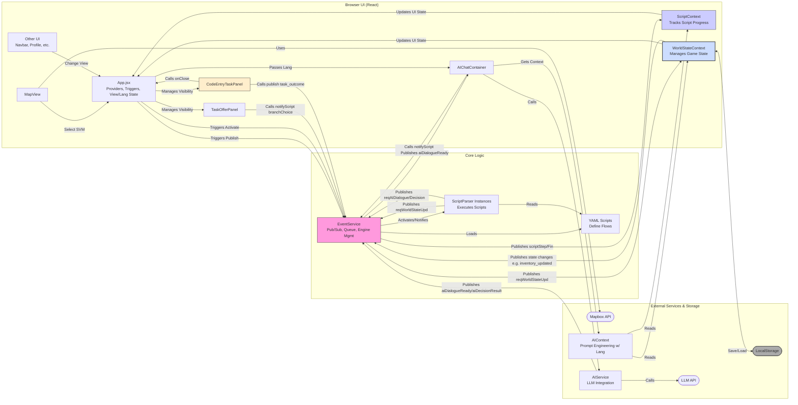

# IdeActuator Demo (SVM_net) ✨

Welcome to the IdeActuator Demo (SVM_net) project! This is a frontend prototype (with a simple flask backend) exploring the vision of transforming urban spaces into interactive game worlds using AI, smart devices (like simulated Smart Vending Machines - SVMs), mobile interfaces, and game mechanics.
If you are interested in it, please contact me with my email: zzhouch@connect.ust.hk

**Vision:** To create engaging, location-based experiences that blend the virtual and real, making the city itself a playground.

**Current Status:** This project is in the development or testing phase, featuring multiple key functional modules such as world state management, script parsing, AI dialogue generation, map views, and task systems. It showcases complex interactivity and game mechanics, including puzzle systems, clue logs, task panels, AI chat functionalities, and map navigation. However, there are debugging codes and comments indicating that some functionalities are incomplete or require optimization, such as commented-out features, temporary code, and unresolved error handling.

## 🚀 Features (Current)

*   **Interactive Map:** Displays simulated SVM locations using Mapbox GL JS. Markers change based on SVM status and active tasks.
*   **Event-Driven Core:** Built around an `EventService` for decoupled communication between components.
*   **YAML Script Engine:** Interprets YAML files (`scripts/events/`) to drive sequences involving:
    *   Dialogue with characters (shown in AI Chat Container).
    *   Task Offers (`TaskOfferPanel`).
    *   Code Entry Tasks (`CodeEntryTaskPanel`) triggered by scripts.
    *   Waiting for specific events (including `task_outcome` from code entry tasks).
    *   Requesting world state updates.
    *   Conditional branching based on world state or event data.
*   **Centralized World State:** `WorldStateContext` manages key game state (`svms`, `activeTask`, `player`) providing a single source of truth.
*   **Basic Persistence:** World state (`svms`, `activeTask`, `player`) is saved to and loaded from `localStorage`.
*   **Context-Aware AI Chat:**
    *   Integrates with an LLM via OpenRouter (`AIService`).
    *   `AIChatContainer` allows free-form chat and displays script dialogue.
    *   `AIContext` injects current world state (`svms`, `activeTask`) and script progress into the AI's system prompt, enabling context-specific answers.
    *   **Language Selection:** AI responses can be requested in English, 中文, or 日本語 via the Startup Screen.
*   **Specialized Task Panels:**
    *   `TaskOfferPanel`: Displays standard task offers with Accept/Decline options.
    *   `CodeEntryTaskPanel`: Handles specific tasks requiring code input (e.g., hacking, data extraction), publishing `task_outcome` events (success/failure).
*   **Core Gameplay Loop Demo:** The `HK_2085_Love_Isaac.yaml` script demonstrate triggering, dialogue, task offering (standard and code entry), state updates, event waiting, and branching.
*   **Puzzle System:** Implements a comprehensive puzzle system with clue logs and interactive elements for engaging gameplay.
*   **Map Navigation:** Provides navigational aids to enhance location-based interactions within the game world.

## 🔧 Tech Stack

*   **Frontend:** React (Vite), JavaScript
*   **Mapping:** Mapbox GL JS
*   **Styling:** Tailwind CSS
*   **State Management:** React Context (`ScriptContext`, `WorldStateContext`)
*   **Scripting:** YAML (`js-yaml` for parsing)
*   **AI:** Fetch API (calling OpenRouter)
*   **Schema Validation:** Ajv (for script validation, currently optional)
*   **Package Manager:** pnpm (recommended, based on `pnpm-lock.yaml`)

## 🏗️ Architecture Overview

The architecture combines an **event-driven** approach with **centralized state management**:

1.  **UI Components:** Render based on state from `ScriptContext` (script progress) and `WorldStateContext` (game state). `App.jsx` manages overall view state, API key, and selected language. Specialized panels like `TaskOfferPanel` and `CodeEntryTaskPanel` are rendered based on script steps or application state (`executingTaskId`). Components publish interaction events or call state update functions.
2.  **EventService:** The central hub, managing event pub/sub, an async queue, and `ScriptParser` lifecycles. Receives events from UI components (e.g., `task_outcome` from `CodeEntryTaskPanel`) and state changes (e.g., `player_inventory_updated` from `WorldStateContext`).
3.  **ScriptParser:** Executes individual YAML script instances based on events. Publishes `requestWorldStateUpdate` events for state changes and `requestAIDialogue`/`requestAIDecision` for AI interactions. Waits for events like `dialogueClosed`, `branchChoice`, `task_outcome`, etc.
4.  **ScriptContext:** Tracks active script progress (`activeEngineDetails`) via events and provides it to the UI.
5.  **WorldStateContext:** Manages core game state (`svms`, `activeTask`, `player`), handles `requestWorldStateUpdate` events to modify state, provides state/update functions to the UI, persists state to `localStorage`, and publishes state change events (e.g., `player_inventory_updated`).
*   **AI Services:** `AIChatContainer` uses context data (including selected language) to format prompts via `AIContext` and interacts with the LLM via `AIService`.



*(See `docs/architecture_overview.html` for a more detailed interactive diagram and explanation).*

## 🏁 Getting Started

### Prerequisites

*   Node.js (LTS version recommended)
*   pnpm (or npm/yarn, but pnpm is preferred)
*   An OpenRouter API Key (see Configuration)

### Installation

1.  **Clone the repository:**
    ```bash
    git clone <your-repository-url>
    cd SVM_net
    ```
2.  **Install dependencies:**
    ```bash
    pnpm install
    ```
3.  **Initialize Capacitor (if building for mobile):**
    ```bash
    npx cap init "IdeActuator" "com.ideactuator" --web-dir=dist
    ```
4.  **Build the project:**
    ```bash
    npm run build
    ```
5.  **Add Android platform (for Android development):**
    ```bash
    npx cap add android
    ```
6.  **Copy built files to Android platform:**
    ```bash
    npx cap copy android
    ```


### Running the Development Server

1.  **Start the Vite dev server:**
    ```bash
    pnpm dev
    ```
2.  Open your browser and navigate to `http://localhost:5173` (or the port specified in the output).

## 🔑 Configuration

### AI Service (OpenRouter)

*   This demo uses OpenRouter to access various LLMs. You need an API key from [OpenRouter.ai](https://openrouter.ai/).
*   When you first run the application, you will see a **Startup Screen** prompting you to enter your OpenRouter API Key and select the desired AI language.
*   ⚠️ **SECURITY WARNING:** The API key is currently stored and used **client-side**. This is **highly insecure** and only acceptable for local development/demo purposes. **Never deploy this code publicly with client-side API key handling.** A backend proxy is required for secure key management in a real application.

### Language Selection

*   The language selected on the Startup Screen (English, 中文, 日本語) is passed to the AI to request responses in that language via the system prompt.

### Mapbox

*   A Mapbox access token is required to render the map. Currently, a public token is hardcoded in `src/views/MapView.jsx`.
*   For production or more robust development, this should be moved to environment variables (e.g., `.env` file and accessed via `import.meta.env.VITE_MAPBOX_TOKEN`).

## 📦 Building for Android with Capacitor

To package this project into an Android app using Capacitor, follow these steps to ensure all necessary assets, including scripts, are included in the build:

### Prerequisites for Capacitor Build

*   Node.js and pnpm installed as per the development setup.
*   Capacitor CLI installed globally (`npm install -g @capacitor/cli`).
*   Android Studio installed for Android development.

### Build Steps

1.  **Build the Web App:**
    Build the React application using Vite to generate the production-ready web assets:
    ```bash
    pnpm build
    ```

2.  **Initialize Capacitor (if not already done):**
    If you haven't initialized Capacitor in your project, run:
    ```bash
    npx cap init
    ```
    Update `capacitor.config.json` with your app ID and name if needed.

3.  **Add Android Platform:**
    Add the Android platform to your Capacitor project:
    ```bash
    npx cap add android
    ```

4.  **Sync Web Assets to Android Project:**
    Sync the built web assets to the Android project:
    ```bash
    npx cap sync android
    ```

5.  **Open Android Studio:**
    Open the Android project in Android Studio to build and run the app:
    ```bash
    npx cap open android
    ```
    In Android Studio, build and run the app on an emulator or connected device.

### Adding New Scripts

When adding new scripts to `scripts/events/`, ensure they are included in the build by running the `prepare-capacitor` script before rebuilding the app. This step copies the updated script files to the `public` directory, making them available in the packaged app.

**Note:** If you encounter issues with scripts not loading in the Android app, verify that the script files are present in `public/scripts/events/` after running the preparation script. If the issue persists, check the console logs in Android Studio's Logcat for errors related to asset loading.

## 🧠 Key Concepts

*   **EventService:** The central message bus using publish/subscribe.
*   **YAML Scripts:** Define interactive sequences, dialogues, tasks, and state change requests. Found in `scripts/events/`.
*   **ScriptParser:** Executes a single script instance, reacting to events.
*   **ScriptContext:** Tracks which scripts are running and their current step for the UI.
*   **WorldStateContext:** The single source of truth for core game state (`svms`, `activeTask`, `player`), handling updates via events and providing state access. Manages `localStorage` persistence and publishes state change events.
*   **AIContext:** Formats system prompts for the AI, injecting relevant game state, script progress data, and selected language preference.
*   **TaskOfferPanel:** UI component for presenting standard tasks with Accept/Decline options. Notifies script via `branchChoice` event.
*   **CodeEntryTaskPanel:** UI component for presenting tasks requiring code input. Publishes `task_outcome` event with `success` or `failure`.

## 📁 Project Structure

```
SVM_net/
├── public/              # Static assets
│   └── assets/          # Other static assets like images
├── scripts/             # YAML Scripts (Top Level)
│   └── events/          # Event-triggered YAML scripts
├── src/
│   ├── components/      # Reusable UI components (Navbar, Panels, StartupScreen, CodeEntryTaskPanel)
│   ├── context/         # React Context providers (ScriptContext, WorldStateContext)
│   ├── core/            # Core logic (ScriptParser)
│   ├── data/            # Initial/static data (SVMs, tasks, products)
│   ├── services/        # Service integrations (EventService, AIService, AIContext)
│   ├── views/           # Major screen components (MapView, SvmDetailView, TaskListView, UserProfileView)
│   ├── App.jsx          # Main application component, providers setup
│   ├── main.jsx         # Application entry point
│   └── index.css        # Global styles (Tailwind base)
├── docs/                # Documentation files
├── tests/               # Unit/Integration tests
├── .gitignore
├── package.json
├── pnpm-lock.yaml
├── vite.config.js
└── README.md            # This file
```
*(Note: Project structure may have evolved slightly)*

## 🧭 Current Status & Roadmap

The project is currently in the development or testing phase, demonstrating complex interactivity and game mechanics through various functional modules. Key features include puzzle systems, clue logs, task panels, AI chat functionalities, and map navigation.

**Challenges & Issues:**
1.  **Incomplete Functionalities:** Some features are not fully implemented or are commented out in the code.
2.  **Optimization Needs:** Certain modules require optimization for better performance and user experience.
3.  **Temporary Code:** Presence of temporary code that needs to be replaced with permanent solutions.
4.  **Error Handling:** Unresolved error handling issues that need to be addressed for robustness.

**Next Steps (Towards "Fun"):**
1.  **AI Tool Calling:** Implement LLM function/tool calling to allow the AI to query game state (`get_svm_details`) or trigger game events (`publish_event`). (See `docs/architecture_plan.md`)
2.  **Richer Gameplay Loops:** Design more engaging sequences involving resources, reputation, or mini-games, leveraging the centralized world state and AI tools.
3.  **Persistence Enhancements:** Expand `localStorage` persistence or explore more robust solutions.
4.  **Visual & Interaction Polish:** Improve UI/UX, add animations, refine aesthetics.
5.  **API Key Security:** Implement a backend proxy for secure API key handling (Essential before any public deployment).

*(See `docs/architecture_plan.md` for more details on the evolution plan).*

## 🙌 Contributing

Contributions are welcome! Please feel free to open an issue or submit a pull request. (Add more specific guidelines if desired).

## 📜 License

MIT License
